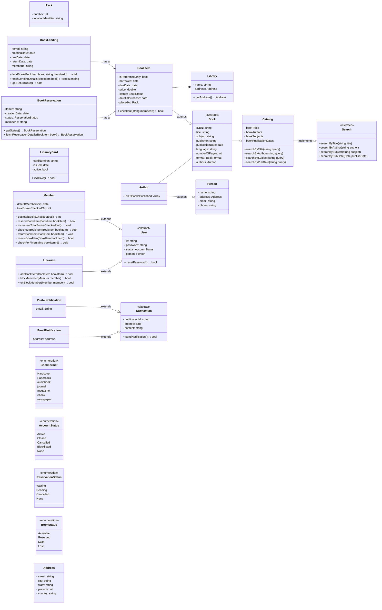

# Class Diagram

```mermaid
classDiagram
direction LR
    class Book {
        <<abstract>>
        - ISBN: string
        - title: string
        - subject: string
        - publisher: string
        - publicationDate: date
        - language: string
        - numberOfPages: int
        - format: BookFormat
        - authors: Author
    }

    class BookItem {
        - isReferenceOnly: bool
        - borrowed: date
        - dueDate: date
        - price: double
        - status: BookStatus
        - dateOfPurchase: date
        - placedAt: Rack
        + checkout(string memberId): bool
    }

    BookItem --|> Book: extends

    class Rack {
        - number: int
        - locationIdentifier: string
    }

    class Person {
        - name: string
        - address: Address
        - email: string
        - phone: string
    }

    class Author {
        - listOfBooksPublished: Array
    }
    Author --|> Person: extends

    class User {
        <<abstract>>
        - id: string
        - password: string
        - status: AccountStatus
        - person: Person
        + resetPassword(): bool
    }

    class Librarian {
        + addBookItem(BookItem bookItem): bool
        + blockMember(Member member): bool
        + unBlockMember(Member member): bool
    }

    class Member {
        - dateOfMembership: date
        - totalBooksCheckedOut: int
        + getTotalBooksCheckoutout(): int
        + reserveBookItem(BookItem bookItem): bool
        + incrementTotalBooksCheckedout(): void
        + checkoutBookItem(BookItem bookItem): bool
        + returnBookItem(BookItem bookItem): void
        + renewBookItem(BookItem bookItem): bool
        + checkForFine(string bookItemId): void
    }

    Librarian --|> User: extends
    Member --|> User: extends

    class LibararyCard {
        - cardNumber: string
        - issued: date
        - active: bool
        + isActive(): bool
    }

    class BookReservation {
        - ItemId: string
        - creationDate: date
        - status: ReservationStatus
        - memberId: string
        + getStatus(): BookReservation
        + fetchReservationDetails(BookItem book): BookReservation
    }

    class BookLending {
        - ItemId: string
        - creationDate: date
        - dueDate: date
        - returnDate: date
        - memberId: string
        + lendBook(BookItem book, string memberId): void
        + fetchLendingDetails(BookItem book): BookLending
        + getReturnDate(): date
    }

    class Notification {
        <<abstract>>
        - notificationId: string
        - created: date
        - content: string
        + sendNotification(): bool
    }

    class EmailNotification {
        - address: Address
    }

    class PostalNotification {
        - email: String
    }

    EmailNotification --|> Notification: extends
    PostalNotification --|> Notification: extends

    class Search {
        <<interface>>
        +searchByTitle(string title)
        +searchByAuthor(string author)
        +searchBySubject(string subject)
        +searchByPubDate(Date publishDate)
    }

    class Catalog {
        - bookTitles
        - bookAuthors
        - bookSubjects
        - bookPublicationDates
        +searchByTitle(string query)
        +searchByAuthor(string query)
        +searchBySubject(string query)
        +searchByPubDate(string query)
    }

    Catalog --|> Search: Implements

    class Library {
        - name: string
        - address: Address
        + getAddress(): Address
    }

    class BookFormat {
        <<enumeration>>
        Hardcover
        Paperback
        audiobook
        journal
        magazine
        ebook
        newspaper
    }

    class AccountStatus {
        <<enumeration>>
        Active
        Closed
        Cancelled
        Blacklisted
        None
    }

    class ReservationStatus {
        <<enumeration>>
        Waiting
        Pending
        Cancelled
        None
    }

    class BookStatus {
        <<enumeration>>
        Available
        Reserved
        Loan
        Lost
    }

    class Address {
        - street: string
        - city: string
        - state: string
        - pincode: int
        - country: string
    }

    BookReservation --> BookItem: has a
    BookLending --> BookItem: has a

    Author -- Book

    Book --o Catalog
    BookItem --* Library
```
